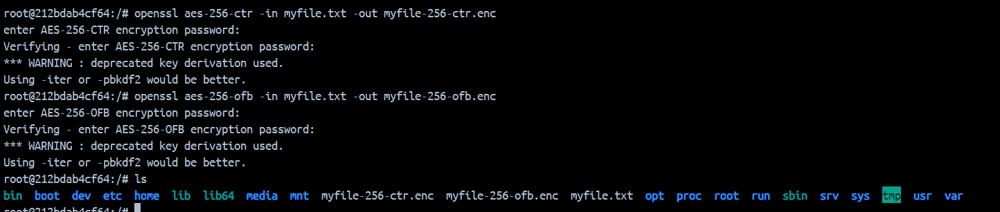

# Task 1: Firewall configuration 
**Question 1**: 
Setup a set of vms/containers in a network configuration of 2 subnets (1,2) with a router forwarding traffic between them. Relevant services are also required:
- The router is initially can not route traffic between subnets
- PC0 on subnet 1 serves as a web server on subnet 1
- PC1,PC2 on subnet 2 acts as client workstations on subnet 2 \
**Answer 1**:
To setup the containers as per request, here docker compose is used for its convenient. We first break down the requirements:
1. There will be 4 services: router and pc0, pc1, pc2
2. There will be 2 networks: subnet1 and subnet2
3. PC0 on subnet1
4. PC1 and PC2 on subnet 2
5. Router on both subnets

The docker-compose.yml attached along doesn't contain any prebuilt server. All four services are raw ubuntu with pc01 after that being installed with python and fastapi to create a simple webserver.

```
services:
  router:
    image: ubuntu:latest
    tty: true
    networks:
      - subnet1
      - subnet2
  pc0:
    image: ubuntu:latest
    tty: true
    networks:
      - subnet1
  pc1:
    image: ubuntu:latest
    tty: true
    networks:
      - subnet2
  pc2:
    image: ubuntu:latest
    tty: true
    networks:
      - subnet2

networks:
  subnet1:
    ipam:
      config:
        - subnet: 172.16.1.0/24

  subnet2:
    ipam:
      config:
        - subnet: 172.16.2.0/24
```

Using the below command to start up webserver

```
# app.py
import uvicorn

from fastapi import FastAPI

app = FastAPI()

@app.get("/health")
async def health():
    return {"status": "healthy"}

@app.get("/")
async def home():
    return """
    <h2>HOMEPAGE</h2>
"""

if __name__ == "__main__":
    uvicorn.run("app:app", host="127.0.0.1", port=80)
```

`python3 app.py`

**Question 2**:
- Enable packet forwarding on the router.
- Deface the webserver's home page with ssh connection on PC1
**Answer 2**:
1. To enable packet forwarding on the router, we first have access to sudo and use the command
`sudo sysctl -w net.ipv4.ip_forward=1`

After that we can dobule check by using command

`sysctl -a | grep ip_forward`


And now we config iptables to redirect traffic from subnet1 to subnet2 and vice versa.

`iptables -A PREROUTING -s subnet: 172.16.1.0/24 -d 172.16.2.0/24 -p tcp -j DNAT`
`iptables -A POSTROUTING -d 172.16.2.0/24 -j SNAT --to-source 172.16.2.1 -t nat`

2. Before defacing the webserver's homepage, we need to take note that our webserver is running on port 80
First do a quick check using curl command

`curl http://172.16.1.3:80`
`curl -X PUT -H "Content-Type: text/html" -d "<h1>DEFACED!</h1>" http://172.16.1.3:80`

Note: 172.16.1.3 is our router IP, checking by using docker inspect

**Question 3**:
  Config the router to block ssh to web server from PC1, leaving ssh/web access normally for all other hosts from subnet 1.   

**Answer 3**:
- For this config, we continue using iptables to block and allow traffic, as mention above we have already redirect all traffic from subnet1 to subnet2 and vice versa.

- Allow SSH and web access from all hosts on subnet 1 except PC1
`iptables -A INPUT -p tcp -s 172.16.1.0/24 --dport 22 -j ACCEPT`
`iptables -A INPUT -p tcp -s 172.16.1.0/24 --dport 80 -j ACCEPT`

- Block SSH access from PC1 to web server
`iptables -A INPUT -p tcp -s 172.16.2.3 --dport 22 -j DROP`

- Allow all other traffic
`iptables -A INPUT -j ACCEPT`

**Question 4**:
- PC1 now servers as a UDP server, make sure that it can reply UDP ping from other hosts on both subnets.
- Config personal firewall on PC1 to block UDP accesses from PC2 while leaving UDP access from the server intact.
**Answer 4**:


# Task 2: Encrypting large message 
Use PC0 and PC2 for this lab 
Create a text file at least 56 bytes on PC2 this file will be sent encrypted to PC0
**Question 1**:
Encrypt the file with aes-cipher in CTR and OFB modes. How do you evaluate both cipher in terms of error propagation and adjacent plaintext blocks are concerned. 
**Answer 1**:
- Demonstrate your ability to send file to PC0 to with message authentication measure.
- Verify the received file for each cipher modes

- We first create our message using touch myfile.txt and nano myfile.txt to edit the content
- Once done, openssl will be used to encrypt the file in both CTR and OFB mode with the following command:

`openssl aes-256-ctr -in myfile.txt -out myfile-256-ctr.enc`
`openssl aes-256-ofb -in myfile.txt -out myfile-256-ofb.enc`

image 2.png


- It can be observed that after the above commands has successfully spit out two encrypted files
- If we try to open and read them the same way before the encryption, the content cannot be read anymore
image 3.png


- In terms of error propagation:
  + CTR: each block of plaintext is encrypted independently using a counter value. If an error occurs in one block, it will not affect the decryption of other blocks. 
  + OFB: the output of this block is the input of the next block, therefore if an error occurs in one block, the whole chain after it will be affected

- In terms of adjavent plaintext blocks:
  + CTR: since each block is encrypted independenly, identical blocks will result in identical ciphertext blocks.
  + OFB: all blocks are related to each other, identical blocks will not result in identical ciphertext blocks.

- Once we got the encrypted file, next is to create a digital signature to ensure the integrity of the file during transmission

- First create a public-private key pair using openssl

`openssl genrsa -out private_key.pem 2048`
`openssl req -x509 -new -key private_key.pem -out cert.csr`

- The two files can be observed using ls command


- Next we use the private key to sign the digital signature

`openssl dgst -sha256 -sign private_key.pem -out signature.bin myfile.txt`


- And that's all of the preparation steps, to transfer from PC2 to PC0, we can use the scp command (secure copy) to transfer our myfile.txt.

`scp myfile-256-ctr.enc myfile-256-ofb.enc signature.bin root@172.16.1.3:/`

**Question 2**:
- Assume the 6th bit in the ciphered file is corrupted.
- Verify the received files for each cipher mode on PC0

**Answer 2**:

- Pretend that the 6th bit is corrupted, we use python to recreate that.


**Question 3**:
- Decrypt corrupted files on PC0.
- Comment on both ciphers in terms of error propagation and adjacent plaintext blocks criteria. 

**Answer 2**:
- To decrypt the corrupted file, we use similar command to when encrypt

`openssl enc -d -aes-256-ctr -K 123456 -in corrupted_ctr.txt -out decrypted_ctr.txt`
`openssl enc -d -aes-256-ofb -K 123456 -in corrupted_ofb.txt -out decrypted_ofb.txt`

- After decrypting the corrupted ciphertexts, we can observe the following:
  + CTR: the corrupted bit in the ciphertext has resulted error at that one specific bit in the decrypted plaintext. The error has not propagated to adjacent plaintext blocks.
  + OFB: the corrupted bit in the ciphertext has resulted error happened in many places the decrypted plaintext. The error has propagated to adjacent plaintext blocks.


